# 소보로(SOBORO) : 소리를 보는 길(路)

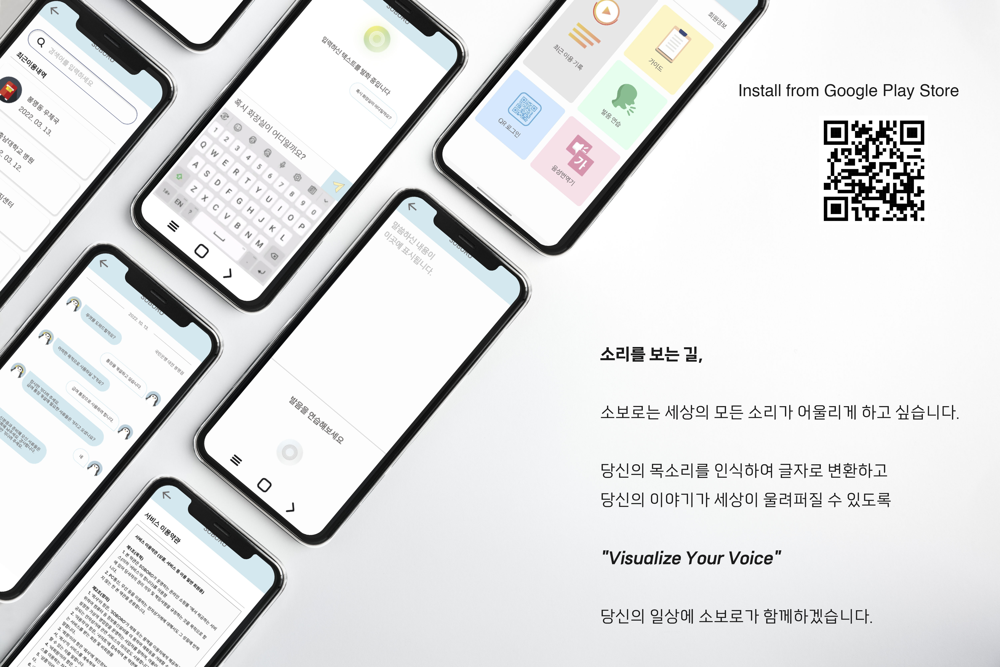

- 인공지능 언어 통역 서비스
- 청각 장애인을 위한 언어 번역 도우미

### SOBORO WEB (FE, BE) : 서비스 중단

### SOBORO APP (Android) : [Google Playstore 소보로(SOBORO)](https://play.google.com/store/apps/details?id=com.project.soboro)

<br>

## :scroll: 프로젝트 개요

### _Visualize Your Voice, 당신의 목소리를 보여드립니다._

:musical_note: 소보로(SOBORO)는 모든 소리가 하나되는 세상을 지향합니다.

:earth_americas: 소보로(SOBORO)는 모두가 나의 목소리로 소통하는 세상을 그리고 싶습니다.

길을 건널 때 신호의 종료를 알리는 소리, 맛있는 냄새가 풍기는 상가를 지날 때 흘려 퍼지는 흥겨운 음악 소리, 계절에 따라 바뀌는 음원 차트의 신나는 음악들...
이 모든 것이 누군가에겐 들을 수 없다는 사실을 알고 계시나요?

소보로(SOBORO)는 AI 음성 인식 기술과 함께 누구나 보편적인 삶을 살 수 있는 사용자 경험을 소개하고 싶습니다.

당신의 소리가 우리의 소리가 되는 곳, :musical_note: **소보로(SOBORO)** 가 함께하겠습니다.

<br>

## :musical_score: 주요기능

### 1. 사용자를 위한 맞춤 발음 교정 서비스

- 혼자만의 프라이버시가 존중되는 공간에서 누구나 편안하게 나의 소리를 연습할 수 있도록, 당신의 목소리를 우리말(한글)로 번역합니다.
- 개인 모바일 기기에서 앱을 설치하여 무료로 발음 교정 서비스를 이용해 보실 수 있습니다.

### 2. 사용자를 위한 퍼스널 음성비서

- 상대방과의 막힘 없는 원활한 소통을 지원합니다.
- 메신저 앱을 사용 하듯이 소보로 앱을 사용하여 대화를 시작하면 소보로가 당신의 목소리를 내어드립니다.

<br>

## :clapper: 프로젝트 기간

2023 02 23 (월) ~ 2023 04 07 (금)

<br>

## :hammer_and_wrench: 프로젝트에 사용된 기술

**Back-end : Spring Boot**

```Plain Text
- Springboot 2.7.8
- Spring Data JPA
- Spring Security
- Redis
- OAuth2
- Swagger 3.0.0
- MariaDB
- MongoDB
- Logger
```

**Front-end : Next.js**

```Plain Text
- next 13.2.4
- react 18.2.0
- react-dom 18.2.0
- react-qr-reader 3.0.0-beta-1
- react-web-qr-reader 1.0.4
- react-webcam 7.0.1
- socket.io 4.6.1
- socket.io-client 4.6.1
- typescript 5.0.2
```

**Front-end : Android (Kotlin)**

```Plain Text
- Kotlin 221-1.7.21-release-for-android-studio-AS5591.52
- Gradle 7.3.3
- compileSdk 33
- minSDK 31
- targetSdk 32
- Java 11
- ZXing Android Embedded (QR 생성기)
- Gson 2.9.0
- retrofit2 2.9.0
- ViewModel 2.5.1
- okhttp3-logging 3.11.0 (로그 기록)
```

**CI/CD**

```Plain Text
- Git Webhook
- Jenkins
- Docker
- Docker Compoose
- Docker Registry
- Nginx
- Letsencrypt
```

<br>

## :rocket: 협업방식

### **Matter Most**

- 평상시 소통을 위한 도구
- 짧은 코드나 참조 url 공유

### **Notion**

- Config 정리
- 회의록 저장
- 피드백 공유

### **Figma**

- 기획 회의
- 와이어 프레임 구성
- 직접 화면을 구성하면서 회의

### **Jira**

- 일정 관리

### **Git-lab**

- 개발 코드 형상 관리
- 메인, 작업 브랜치와 개인 브랜치 구분

<br>

## :triangular_flag_on_post: Project Info

### Notion

[Notion Link](https://complex-find-e33.notion.site/workspace-0aafe17d3467468987c999ea3e8a00ea)
<br><br>

### **브랜치전략**


<br><br>

### **파이프라인**


<br><br>

### 유저 플로우


<br><br>

### 메뉴 구조


<br><br>

### Figma - 와이어프레임, 화면설계, 화면정의서

[Figma Link](https://www.figma.com/file/22XXHWxZYYdc0vDGniGsmZ/Soboro-Figma-public?node-id=2%3A37552&t=Ms1roWjtK1p6jVa4-1)
<br>

#### 와이어프레임

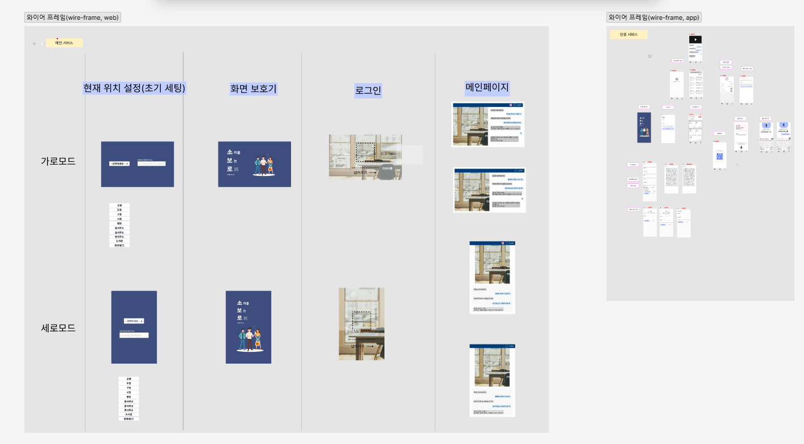

#### 화면설계 (WEB)

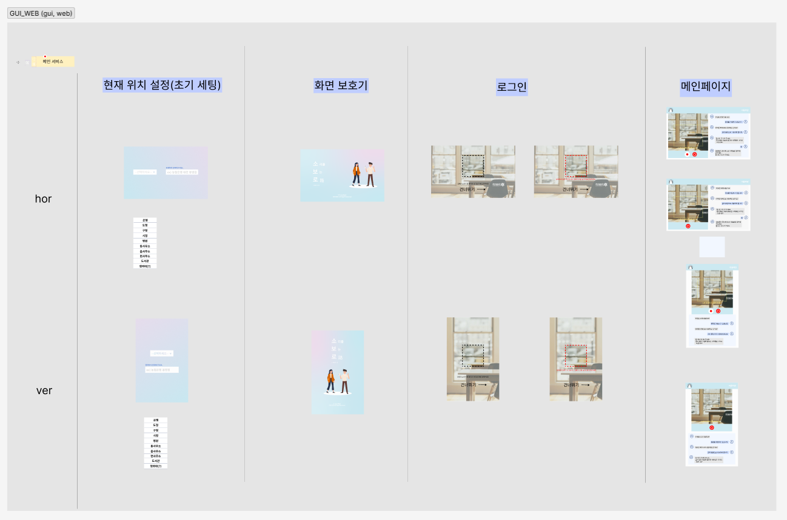

#### 화면설계 (APP)


#### 화면정의서

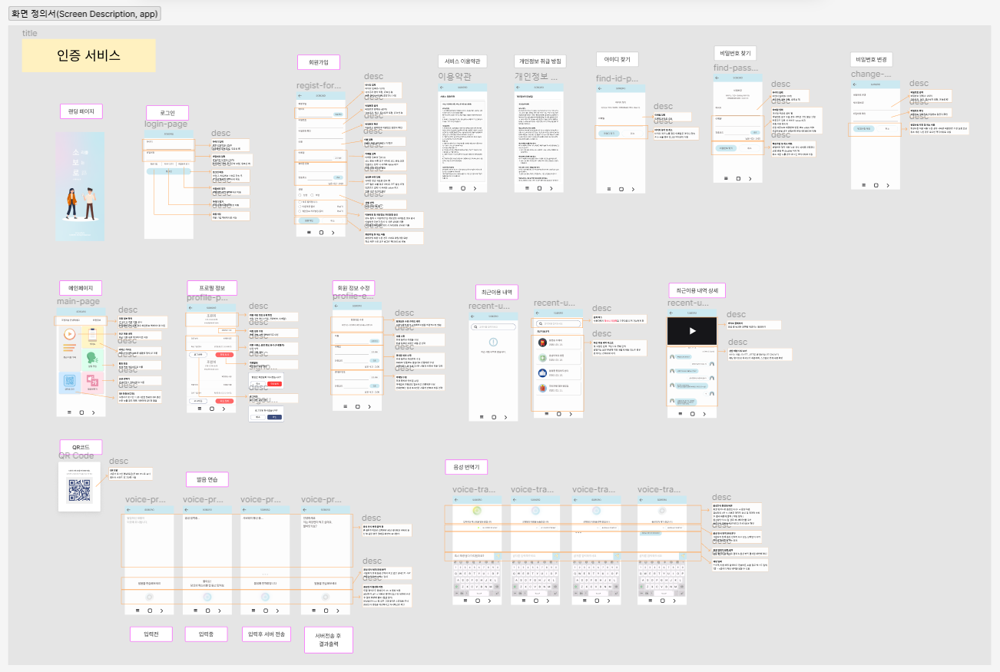

### 기능명세서

[기능명세서 Link](https://docs.google.com/spreadsheets/d/1r_FrYb5DS_ruF9otR7ODI5bUNE9cylJHNTgNKZc0h3k/edit?usp=sharing)

 <br>
 <br>
 <br>
<br>

### 아키텍쳐 설계


<br><br>

### E-R Diagram


<br><br>

### API 명세서

[API 명세서 Link](https://complex-find-e33.notion.site/API-1f691f0583c74a14b8530626260a66a3)
<br>

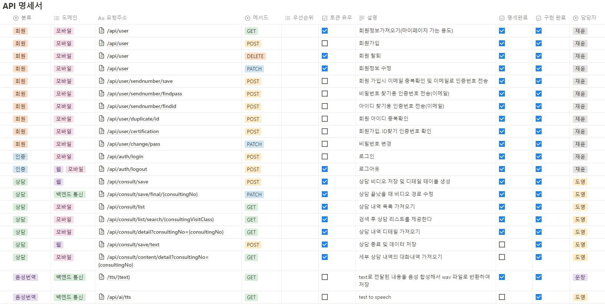

<br>

## 시연 영상

- [STT (Speech to Text)](https://www.youtube.com/watch?v=uDi6ujsQ0Do)
- [TTS (Text to Speech)](https://www.youtube.com/watch?v=Eqmkn2AgeGk)

<br>

## 서비스 화면 (WEB)

### 메인 페이지

- WEB 대기화면 페이지


### 상담 페이지 (VTT, STT)

- WEB 상담 페이지
- 카메라가 수어를 인식하여 텍스트로 변환
- 음성이 인식되면 텍스트로 변환

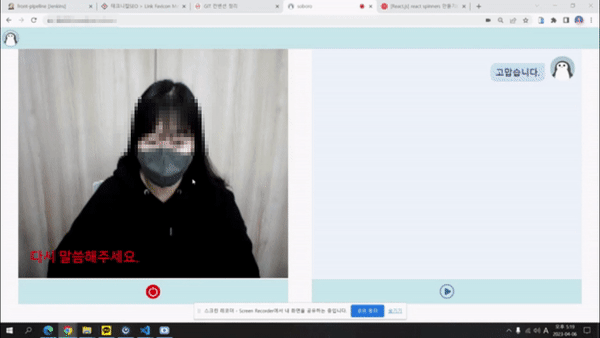 <br>
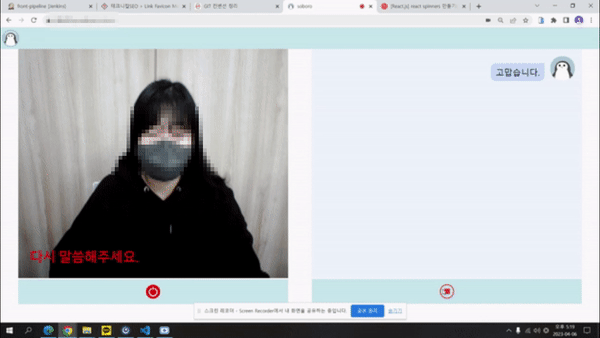 <br>
<br>

## 서비스 화면 (APP)

### 메인 페이지

- 안드로이드 앱 로그인 시 진입하는 메인 액티비티
- 최근 이용 기록 버튼을 눌러 최근 상담 내역을 조회할 수 있음
- QR로그인을 이용해 WEB페이지 간편 로그인 지원
- 음성을 텍스트로 변환하는 발음연습 기능 제공
- TTS, STT 기능을 지원하는 음성 번역기 제공

<div align="left">
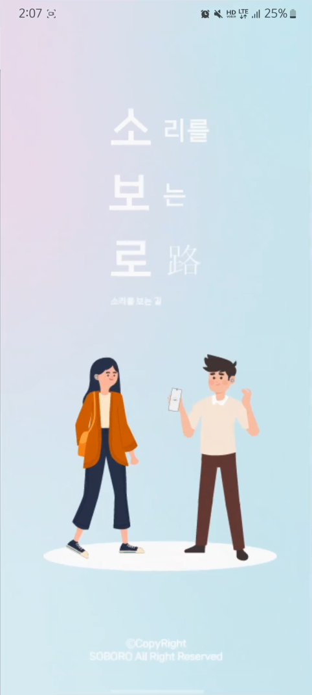
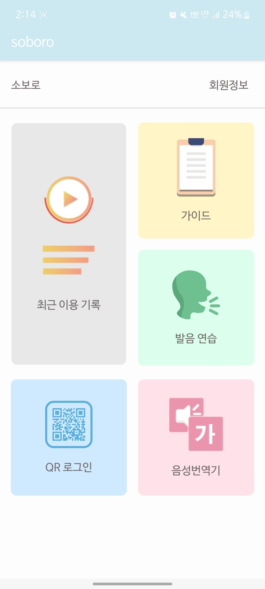
</div>

### 발음 연습 (STT)

- "대전의 자랑 튀김 소보로" 소리를 텍스트로 변환

<div align="left">
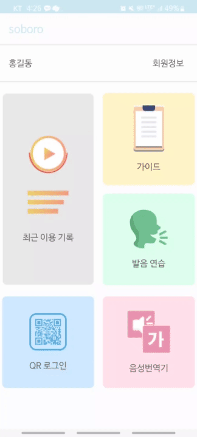 
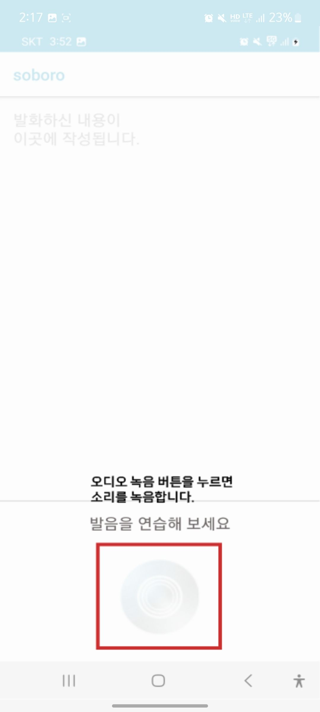
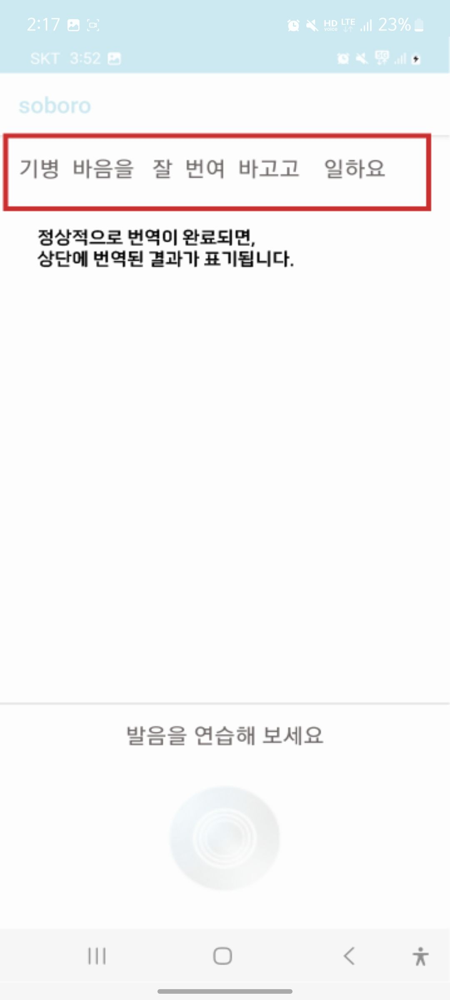
</div>

### 음성번역기 (STT, TTS)

- STT(Speech to text), TTS(Text to Speech) 기능 지원
- STT는 두 가지 모델로 사용가능 (학습 모델, 네이버 클로버 모델)

<div align="left">
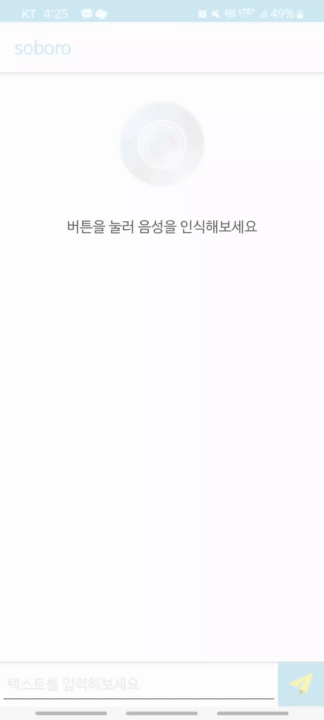
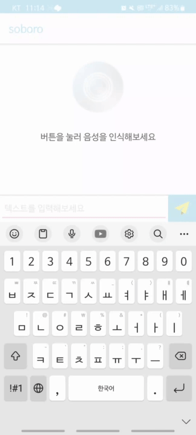
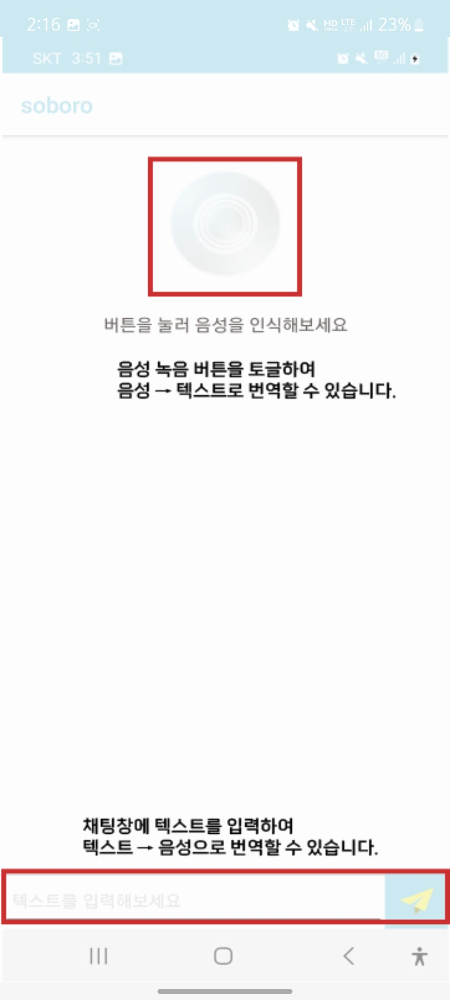
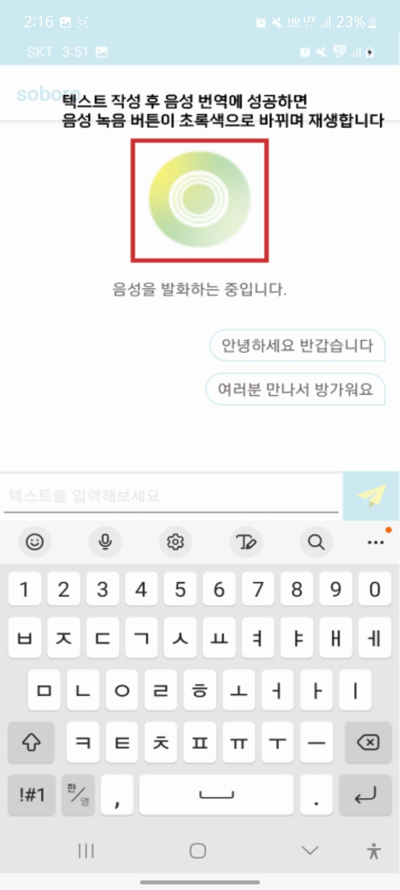
</div>

### 최근 이용 기록

- WEB에서 상담한 내역을 App에서 조회할 수 있음

<div align="left">
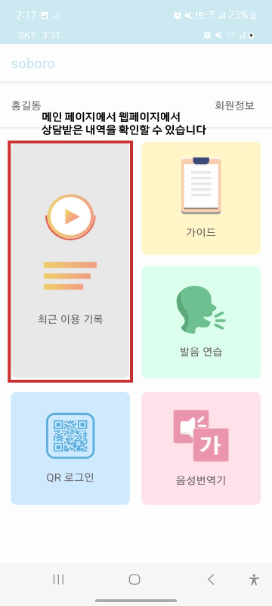
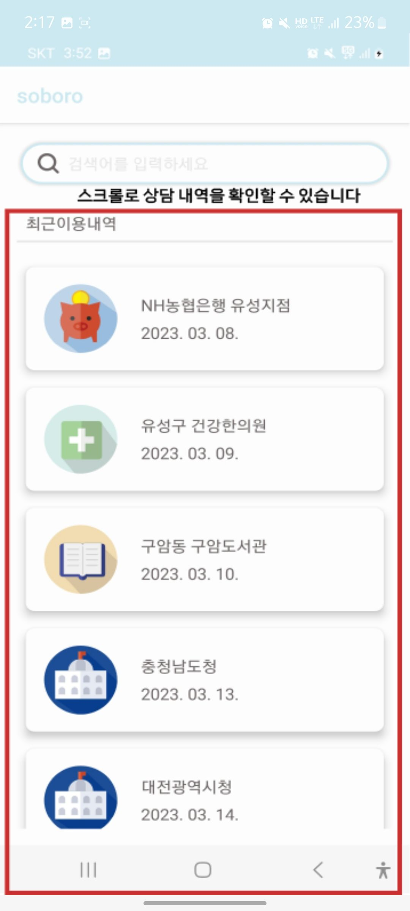
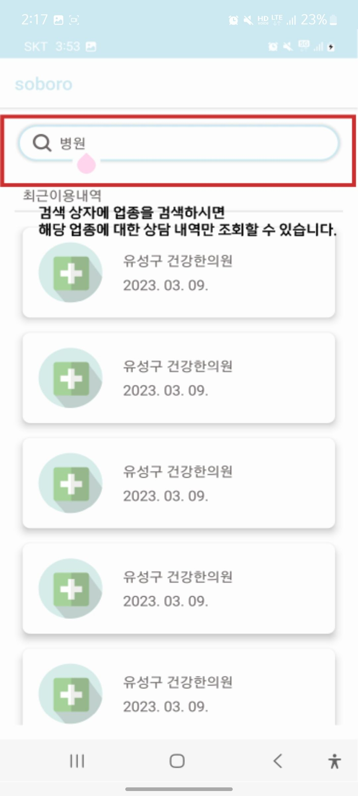
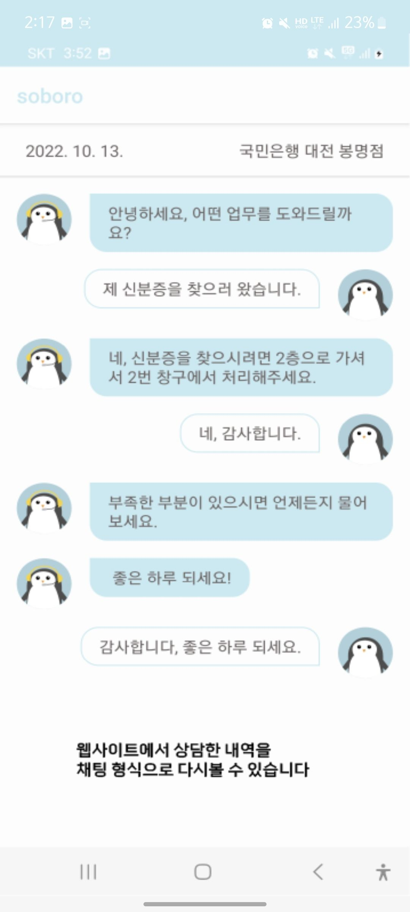
</div>

### 로그인 & QR 로그인

- QR로그인을 이용하여 WEB에서 간편 로그인 할 수 있음

<div algin="left">
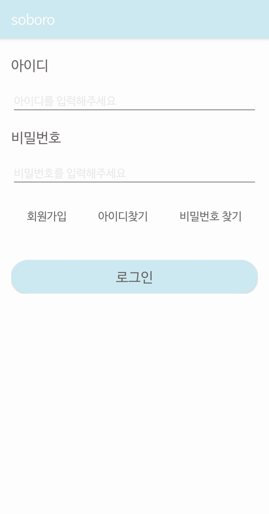
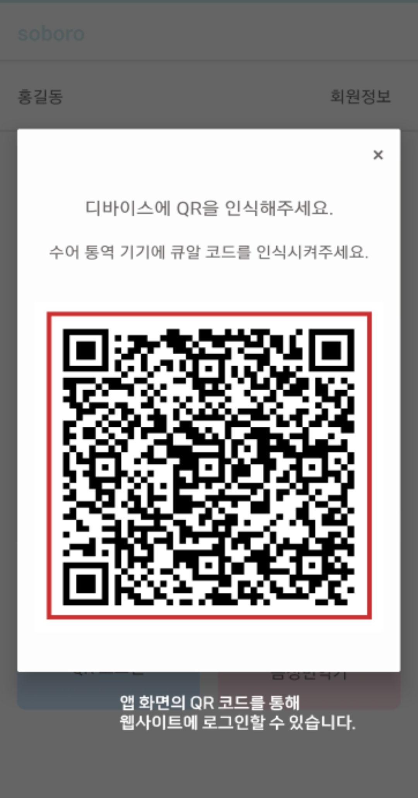
</div>

### 회원가입

- 회원 가입 액티비티
- 회원은 최근 상담 내역을 기록과 조회할 수 있음

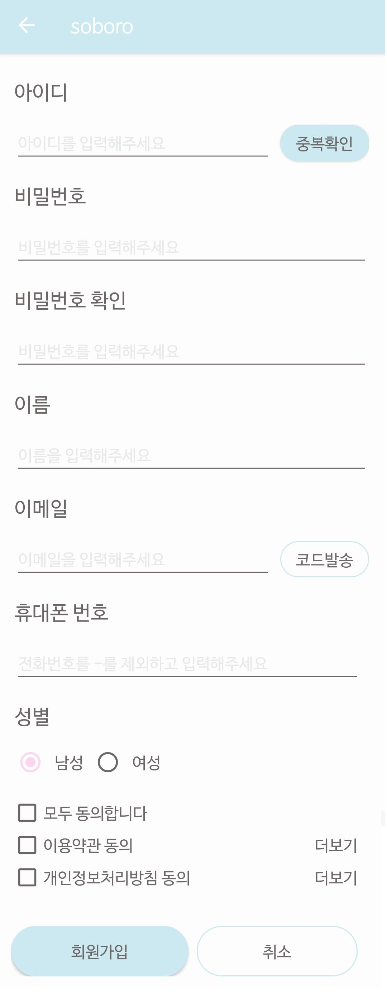

### 회원정보

- 앱 내 사용자 정보 확인 액티비티


## Project Member - 일석2조

- 조원희 (Team Leader, Android)
- 김은영 (FrontEnd, AI)
- 이수민 (AI, CI/CD)
- 장운창 (AI, CI/CD)
- 한재윤 (BackEnd)
- 황도영 (BackEnd)
